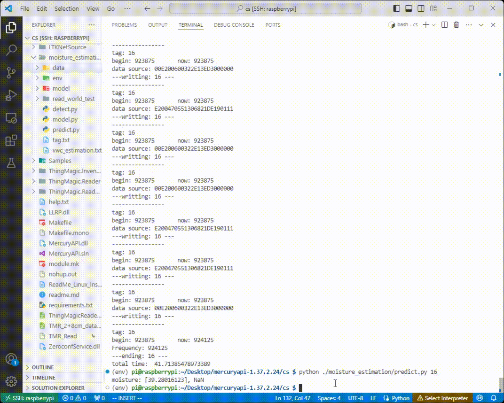

# Soil Moisture Sensing by RFID tags

This repository contains the relevant files for our soil moisture sensing project based on UHF RFID tags. Specifically, we find the fact that Commercial Off-The-Shelf (COTS) RFID tags are already impedance-matched in terms of their antenna and chip design. When these tags are attached to a pot, the impedance of the tag antenna is affected by the soil moisture inside the pot, which disrupts the impedance matching and increases the minimum transmission power(MRT) of the tag.

Inspired by this phenomenon, we have designed the RFID tags in a special way so that they initially reside in an impedance-mismatched state. As the tags are partially inserted into the soil, the impedance of the tag's antenna changes, improving the degree of impedance matching. This, in turn, affects the received signal strength indicator (RSSI). Additionally, we assign a reference tag to each moisture-sensing tag to mitigate environmental influences. Finally, by measuring the difference between the RSSI of the designed tag and the reference tag, known as Differential RSSI, we estimate the soil moisture.

Assuming we are in the CS directory, including command line mode

## Directory Structure

Except for the "./moisture_estimation" directory, all other directories contain files used by the ThingMagic MercuryAPI to control the reader. Our code for controlling the reader is located in `./TMR_Read`, and by modifying the symbolic link file `ReadAsync.cs`, we can change the reader's behavior, such as the reading time on each channel on each channels and TxPower.

Regarding the `./moisture_estimation` directory, it includes all the code for processing reader data, as described below:

**./moisture_estimation/data** : This directory stores all the collected data. Each file contains the metadata collected at a specific tag location.

**./process/detect.py**: This program detects tags and displays the detected tag numbers within a specified time. It saves a specific file based on your input, which is necessary for subsequent steps. The file is stored in ./process/data and its format is "Data_number.txt".

**./process/predict.py**: This program predicts humidity. It takes a command line parameter(tag numbers) to obtain the file to be predicted, generates humidity estimation results, and stores them in `./moisture_estimation/vwc_estimation.txt`.

**./process/tag.txt**:  store all sensing and reference tag ID information.

Our code consists of two main parts: dotnet code for controlling the reader to perform tag reading, and python code with the environment already set up using venv. For dotnet environment configuration, please refer to `ReadMe_Linux_Install_CompileRun_Steps.txt`. To activate our virtual environment named "env" for python, simply use the command `source ./moisture_estimation/env/bin/activate`.

Recompile the modifiedx`ReadAsync.cs`:

`dotnet clean Samples/Codelets/ReadAsyncLinux/ReadAsyncLinux.csproj`

`dotnet build Samples/Codelets/ReadAsyncLinux/ReadAsyncLinux.csproj`

## Quickstart

1. Check the drone for flight readiness, start the RFID reader and Raspberry Pi, use Wi-Fi to remotely connect to the Raspberry Pi from the laptop using VS Code.

2. Start the reader and redirect the output to nohup.out, keep the reader in a reading state until the end of the experiment, and activate the Python environment simultaneously.

    ```bash
    nohup Linux/ReadAsync tmr:///dev/ttyACM0 --ant 1,2 &
    source ./moisture_estimation/env/bin/activate
    ```

3. Check the latest tag information that the reader has currently read, observe if the reader is working properly.

    ```bash
    tail --line 50 nohup.out`
    ```

    

4. Pilot the drone to fly near the tag that needs to be measured (typically directly in front of the tag in our experiment).

5. Run detect.py, and then our program will detect the tag numbers that can be read during this period of time. From these numbers, we will select the tag number for which we want to save the data. Subsequently, the program will save the data read by the reader in the `./moisture_estimation/data` directory, specifically in the `Data_ID.txt` file. For example:

    ```bash
    python ./moisture_estimation/detect.py
    ```

    

    

6. Obtain soil moisture estimation for the deployment location of the tags.

    ```bash
    python ./moisture_estimation/predict.py ID
    ```

    Then, you will obtain the corresponding soil moisture estimation for the tags at the time when our predict.py is running, and the results will be saved in `./moisture_estimation/vwc_estimation.txt`. (As shown in the figure below, the two estimation values are from data received by two different antennas. The `NaN` value in the moisture estimation result is because the antenna did not receive complete data.)

    

7. Continue operating the drone to proceed to the next tag deployment location.

**Note**: if you want to change the in/out-put path and so on, please pay attention to lines 205, 206 in the predict.py and lines 8, 31, 56, 57, 69, 132 in the detect.py.
