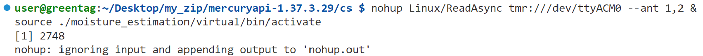
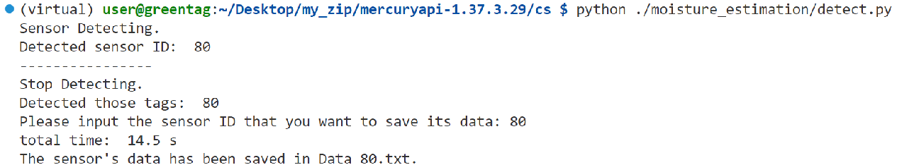
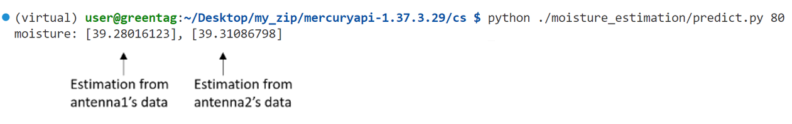

# Soil Moisture Sensing with UHF RFID tags

This repository explains the workflow and files of our soil moisture sensing system based on UHF RFID tags. Specifically, we design RFID moisture sensing tags that their signal features, such as received signal strength (RSS) and phase, change with the soil moisture levels. Additionally, we assign a reference tag to each moisture-sensing tag to mitigate environmental influences. That is to say, we design our RFID moisture sensor with a sensing tag and a reference tag. Finally, by measuring the differential RSS of the two tags, our sensor can estimates the soil moisture.

## Overview and Hardware Preparation
The below figure shows the hardware connections of our system:


- Our RFID moisture sensors are wirelessly connected to a FU-M6-M-4G RFID reader.
- The reader is connected to a Raspberry Pi 4B via USB for controlling the reader and collecting RSS data.
- Based on the collected RSS data, the Raspberry Pi can estimate the moisture levels by using the code shown in this repository.
- To remotely access the Raspberry Pi, we connect a 4G LTE module to it. To use the 4G module, one needs to insert a local SIM card into it. Alternatively,  one can use a local Wi-Fi network for a short distance remote connection or test.
**You may start to use our system from the `Quickstart'**

## Quickstart

1. **Power on the system.** Deploy the RFID reader and Raspberry Pi on UAV. Then, power on the RFID reader and Raspberry Pi.
2. **Remote Connection.**
    We use VSCode's Remote SSH to connect remotely to the Raspberry Pi. If Visual Studio Code is not installed on laptop, please refer to [Connect over SSH with vscode](https://code.visualstudio.com/docs/remote/ssh-tutorial) for installation.
    Then, open VS code, connect the Raspberry Pi with a laptop using a 4G LTE remote connection or a local Wi-Fi Conection. Once the connection is on, open the `/home/user/Desktop/soilmoisture-sensing` directory in the Pi via VS Code.

    Remote Connection via 4G LTE:
    ```bash
    // In China
    HostName: 8.tcp.cpolar.cn
    Port: 11167
    User: user
    password: 12345678
    // In UK
    HostName: 1.tcp.eu.cpolar.io
    Port: 10054
    User: user
    password: 12345678
    ```
    
   
    Remote Connection via local Wi-Fi: Ensure that the Raspberry Pi and laptop are connected to the same Wi-Fi, the WiFi name and password are fixed.
    ```
    Wi-Fi name:aaa
    Wi-Fi password:12345678
     ```
    Use `ssh user@GreenTag` to connect , the connection password is `123456` , and other operations are the same as using a 4G LTE.
   
4. **Check if the reader is working properly.** Place one RFID tag or one of our RFID moisture sensor in front of the reader. Then, start the reader and redirect the output to nohup.out, keep the reader in a reading state until the end of the experiment, and activate the Python environment simultaneously.

   Switch directory to /Desktop/my_zip/mercuryapi-1.37.3.29/cs
   ```
    cd /Desktop/my_zip/mercuryapi-1.37.3.29/cs
   ```
    ```bash
    nohup Linux/ReadAsync tmr:///dev/ttyACM0 --ant 1,2 &
    source ./moisture_estimation/virtual/bin/activate
    ```
    

    Check the tag information that the reader has currently read, if we see the output in bash similar to the following figure, we know the reader is working properly. (We didn’t collect MRT, so fill the gaps with zeros)

    ```bash
    tail --line 40 nohup.out
    ```

    

6. **Data collection with UAV.** Pilot the drone to fly to the targeted RFID moisture sensors, which include a reference tag and a sensing tag.

    Make sure the measured tags are in front of the reader’s antenna within <0.5m or even less. Note that the reader’s data collection program runs in the background until the end of the experiment.

7. **Extract the data of a targeted RFID moisture sensors at each location.**

    Run `detect.py`, which detects sensor IDs that can be read. From these IDs, we can extract and save the data of our targeted sensors at each location.

    ```bash
    python ./moisture_estimation/detect.py
    ```

    

    Note that, once you "input the sensor ID that you want to save its data", the detect.py will save the collected data into a Data_ID.txt file, where 'ID' means the sensor's ID. The Data_ID.txt file is located in the `./moisture_estimation/data directory`. For example:

    

8. **Data collection over all locations**. Pilot the drone to fly to the next targeted RFID moisture sensor, and repeat the previous step 5, until the sensor data of all locations are collected.
9. **Stop RFID reader after finishing data collection at all locations.**

    ```bash
    ps aux | grep Read  # find reading process
    ---
    output like:
    user       52987 41.8  0.5 3338164 40336 pts/3   Sl   20:41   2:55 Linux/ReadAsync tmr:///dev/ttyACM0 --ant 1,2
    user       57278  0.0  0.0   6088  1920 pts/3    S+   20:48   0:00 grep --color=auto Read
    ---
    kill 52987  # kill process by process ID
    ```

10. **Soil moisture estimation.** By running the code below, one can estimate soil moisture of a targeted sensor.

    ```bash
    python ./moisture_estimation/predict.py SensorID
    ```
    For example, to estiamte the soil moisture of SensorID=8 sensor, one may run: python `./moisture_estimation/predict.py 8`. The estimated moisture levels are saved in `./moisture_estimation/vwc_estimation.txt`. Note that, if you see an NaN value in the moisture estimation, it is because the antenna did not receive data.

    

**Note**: if you want to change the in/out-put path and so on, please pay attention to predict.py and detect.py.


## Directory Structure

(1) **Reader controlling**. Except for the `./moisture_estimation` directory, all other directories contain files used by the ThingMagic MercuryAPI to control the reader. Our code for controlling the reader is located in `./TMR_Read`, and by modifying the symbolic link file `ReadAsync.cs`, we can change the reader's behavior, such as the reading time on each channel  and TxPower.

(2) **Data collection, preprocessing and moisture estimation**.
Regarding the `./moisture_estimation` directory, it includes all the code for processing reader data, as described below:

**./moisture_estimation/data** : This directory stores all the collected data. Each file contains the metadata collected at a specific tag location. For example, the below figure shows measurement of sensor 19 and 80.


Contents of `Data_80.txt`:


**./process/detect.py**: This python code will show the detected tags. More details are in “step 5 of Quickstart” below.

**./process/predict.py**: This program estimates the soil moisture, and stores estimations in `./moisture_estimation/vwc_estimation.txt`. More details are in "step 6 of Quickstart" below.

**./process/tag.txt**:  The txt file stores the RFID moisture sensor ID information. For Example:

```text
tag11,00001100,E0001100
tag12,00001200,E0001200
tag13,00001300,E0001300
tag14,00001400,E0001400
tag15,00001500,E0001500
tag16,00001600,E0001600
tag17,00001700,E0001700
tag18,00001800,E0001800
tag19,00001900,E0001900
tag20,00002000,E0002000
...
```

The first column is the RFID sensor ID, each sensor includes two tags, the second column represents the sensing tag ID, and the third column indicates the reference tag ID. The tag ID consists of 4 digits in total, with the first three digits corresponding to the sensor ID. The last digit, '1', represents a sensing tag, while '0' represents a reference tag.

(3) **Others**.
Our code consists of two main parts: dotnet code for controlling the reader to perform tag reading, and python code with the environment already set up using venv. For dotnet environment configuration, please refer to `ReadMe_Linux_Install_CompileRun_Steps.txt`. To activate our virtual environment named "virtual" for python, simply use the command `source ./moisture_estimation/env/bin/activate`.

Recompile the modifiedx`ReadAsync.cs`:

`dotnet clean Samples/Codelets/ReadAsyncLinux/ReadAsyncLinux.csproj`

`dotnet build Samples/Codelets/ReadAsyncLinux/ReadAsyncLinux.csproj`

## Troubleshooting

1. `Error, catch2: Access to the port '/dev/ttyACM0' is denied.` in tail command. Possible reasons:
- The reader is not powered on.
- After finishing the reading, without using the kill command to terminate the reading process, the reader and Raspberry Pi were directly shutdown.

Solution: Restart the reader.
